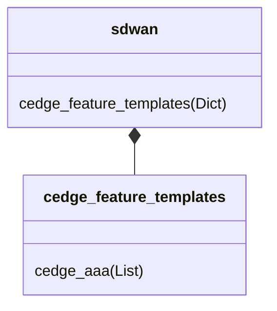
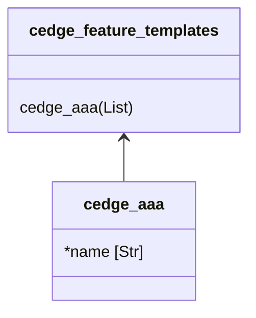

# Overview

The data model formally defines the format of the data input files. The schema is then based on the data model and used to validate the data input files.

## Notation

- `*` before the member denotes a mandatory member
- After the member typically the data type follows (eg. Str, Int, Enum, Dict, List, etc.)
- As class names within the data model must be unique, if needed a suffix with a single digit (eg. `_1`) is added to the name

## Relationships

The composition relationship is used for dictionary child elements.

<figure markdown>

</figure>

The association relationship is used for list elements (1:n relationship).

<figure markdown>

</figure>

## Structure

The vManage configuration is divided into four high level sections:

- `cedge_feature_templates`: Each feature template defines the configuration for a particular Cisco SD-WAN software feature
- `cedge_device_templates`: Device templates define a device's complete operational configuration and consist of a number of feature templates
- `localized_policies`: Localized policies are those policies that are applied locally on the edge routers on the overlay network
- `sites`: Site/node specific configuration (variable values)

## Additional Resources

The *SD-WAN as Code* Data Model describes how to create resources but not what functional purpose they serve within SD-WAN. For more information about SD-WAN please visit [sdwan-docs.cisco.com](https://sdwan-docs.cisco.com/Product_Documentation).
